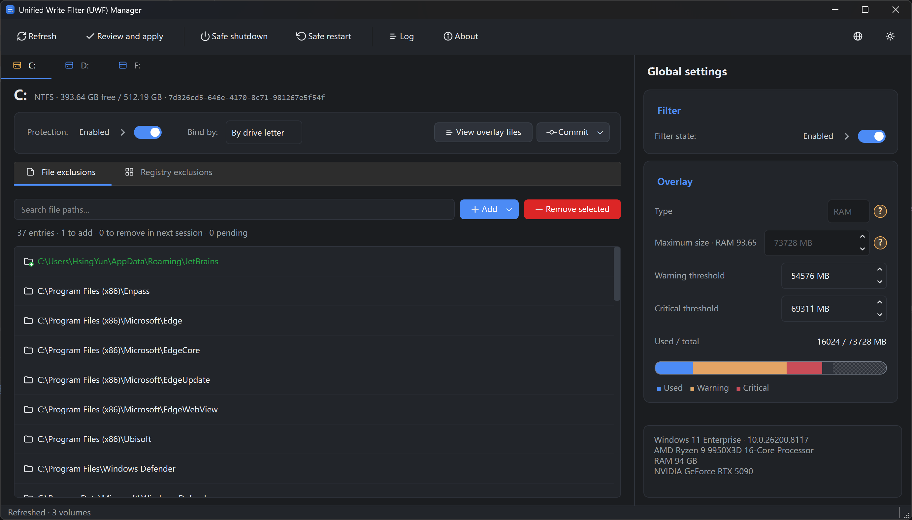

# UWF Manager

A Qt GUI for the Windows Unified Write Filter (UWF) — a convenient graphical front end for inspecting and configuring UWF state, alongside the built-in `uwfmgr.exe` command line.

[简体中文](README.zh_CN.md)



## About UWF

The Unified Write Filter is a sector-level write-protection driver shipped with Windows Enterprise, Education, IoT Enterprise, and the LTSC variants. When a volume is protected, every write to it is intercepted and redirected to an *overlay* — either a region of RAM or a sparse file on a designated disk volume — instead of touching the underlying sectors. The overlay is discarded on reboot, returning the volume to its previous state. File and registry-key exclusions can be declared so that specific paths bypass the overlay and write through to disk; overlay contents can also be selectively *persisted* (committed back to the underlying media) before reboot.

UWF is configured per-volume and operates with two parallel state sets: the *current* session (read-only, reflecting what the driver is enforcing right now) and the *next* session (writable, taking effect after reboot). All configuration changes — enabling protection, setting the overlay type and size, adding exclusions — apply to the next session.

UWF is the supported successor to the older Enhanced Write Filter (EWF) and File-Based Write Filter (FBWF), and is the standard mechanism for building stateless kiosks, point-of-sale terminals, ATMs, medical devices, classroom workstations, and digital signage on Windows.

> **Note**: *Servicing mode* (`uwfmgr filter enable-servicing` / `disable-servicing`, used to suspend the filter for Windows Update or scheduled maintenance) is not planned.

## Features

- Filter enable / disable, current and next session
- Overlay configuration: type (RAM / Disk), maximum size, warning and critical thresholds
- Per-volume protection toggle and drive-letter / volume-ID binding
- File and directory exclusion lists per volume
- Registry exclusion list (system volume)
- DomainSecretKey / TSCAL persistence switches, shown and toggled inline in the registry exclusion list
- Persist overlay contents back to disk or registry (files, directories, file deletions, registry keys)
- Read-only enumeration of overlay file entries
- Import uwfmgr commands — paste or load a command script and stage each line as a pending change
- System restart and shutdown
- In-app log viewer
- Stateless by design — the program keeps no state of its own: it writes no configuration files and no registry keys, and its internal log lives only in an in-memory ring buffer that is discarded when the process exits

## Out of scope

- HORM (Hibernate Once / Resume Many)
- Servicing mode
- Free-space passthrough, persistent overlay, read-only media mode, swapfile creation

## Requirements

- Windows 10 / 11 Enterprise, Education, IoT Enterprise, or LTSC variants
- "Unified Write Filter" Windows feature enabled
- Administrator privileges — needed to apply changes

Note: the program still starts when these conditions are not met.

## Build

- C++20
- CMake ≥ 3.16
- Qt 6 (Widgets, Svg, LinguistTools)
- A Windows-targeting compiler (MSVC, clang-cl, MSYS2 clang64, mingw-w64)

```sh
cmake -S . -B build
cmake --build build --config Release
```

## AI-generated code

Most of the source in this repository was produced by AI coding assistants under human review and direction. Treat the code accordingly: it is functional but you should verify any non-obvious behavior against the source, the WMI documentation, or the running system before relying on it.

## License

GNU General Public License v3.0 — see [LICENSE](LICENSE).
